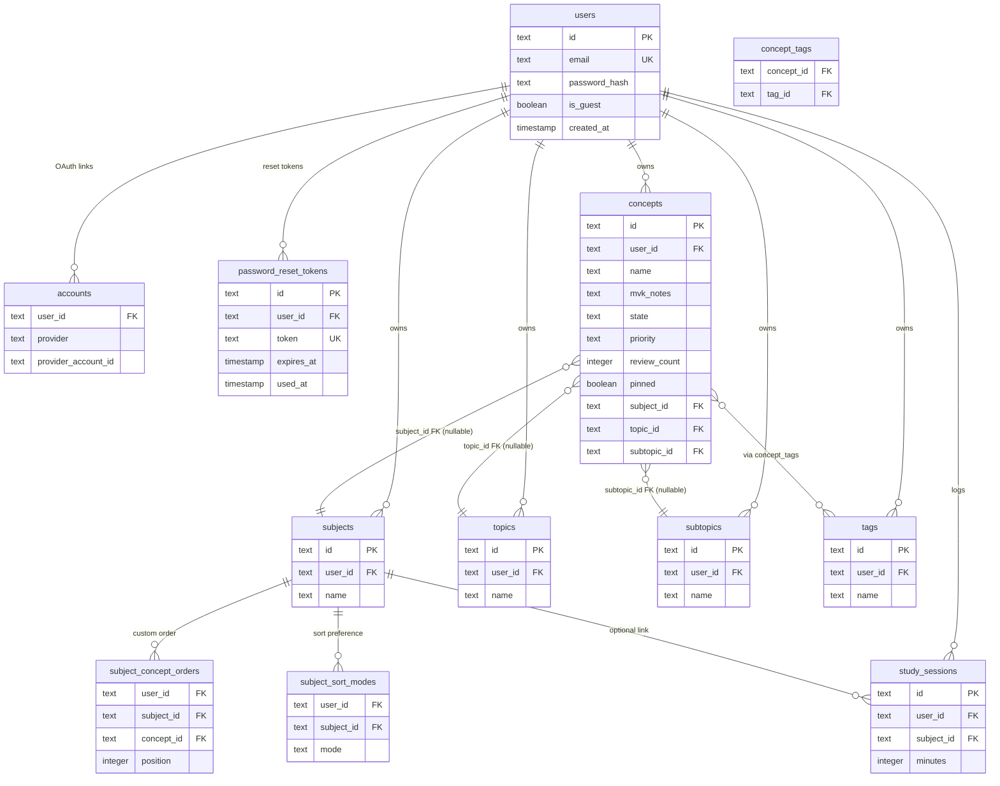

# 03 — Database & ORM

## Stack Summary

| Component | Technology |
|-----------|-----------|
| Database engine | PostgreSQL |
| Hosting | Neon (serverless PostgreSQL) |
| ORM | Drizzle ORM |
| Migration tool | Drizzle Kit |
| Connection driver | `postgres-js` |

---

## PostgreSQL

PostgreSQL ("Postgres") is a full-featured open-source relational database. If you've used MySQL or any SQL database, the concepts are identical. Key features used in this app:

- **Foreign keys with ON DELETE CASCADE** — when a user is deleted, all their data is automatically deleted
- **Unique constraints** — e.g., a user can't have two subjects with the same name
- **Composite primary keys** — junction tables use `(conceptId, tagId)` as PK to prevent duplicates
- **Enums in text columns** — Drizzle uses a `text` column with an enum constraint for `state` and `priority` (no PostgreSQL native ENUM type, which avoids migration complexity)
- **Timestamps with time zone** — all timestamps use `withTimezone: true` to ensure correct UTC storage

---

## Neon — Serverless PostgreSQL

Neon is a cloud PostgreSQL provider built specifically for serverless environments.

### Why "Serverless"?

Traditional managed databases (RDS, PlanetScale) keep a server running 24/7. You pay even when no one is using the app. Neon's serverless architecture:
- **Scales to zero**: when no queries arrive for a few minutes, compute pauses. You pay for actual usage.
- **Fast cold start**: resumes in milliseconds (via compute/storage separation)
- **Connection pooling built-in**: each Vercel serverless function opens a new database connection. Without pooling, you'd hit PostgreSQL's connection limit quickly. Neon provides PgBouncer pooling — the `DATABASE_URL` in production is the **pooled** endpoint.

### Neon Branching

Neon allows creating **database branches** — isolated copies of the database at a point in time. This app uses two branches:

| Branch | When Used | How to Point To |
|--------|-----------|----------------|
| `main` | Production (Vercel environment) | Set in Vercel environment variables |
| `dev` | Local development | Set in `.env.local` as `DATABASE_URL` |

Before applying any schema change to production:
1. Apply to `dev` branch first
2. Test the app locally
3. Apply to `main` branch before deploying

This prevents a broken migration from taking down production.

---

## Drizzle ORM

Drizzle is a TypeScript ORM that lets you define your database schema in TypeScript, build type-safe queries, and generate SQL migrations. Think of it as a lighter-weight alternative to Hibernate/JPA but for TypeScript.

### JPA vs Drizzle Mental Model

| JPA / Hibernate | Drizzle ORM |
|----------------|-------------|
| `@Entity public class Concept` | `export const concepts = pgTable('concepts', {...})` |
| `@Column(name = "mvk_notes")` | `mvkNotes: text('mvk_notes')` |
| `@Id @GeneratedValue` | `id: text('id').primaryKey().$defaultFn(() => crypto.randomUUID())` |
| `@NotNull` | `.notNull()` |
| `@UniqueConstraint` | `unique().on(t.userId, t.name)` in table config |
| `@ManyToMany @JoinTable` | Explicit junction table + `primaryKey()` |
| `@OneToMany(cascade = CascadeType.ALL)` | `.references(() => users.id, { onDelete: 'cascade' })` |
| `entityManager.find(Concept.class, id)` | `db.query.concepts.findFirst({ where: eq(concepts.id, id) })` |
| `entityManager.persist(concept)` | `db.insert(concepts).values({...})` |
| `@Query("SELECT c FROM Concept c WHERE c.userId = :userId")` | `db.select().from(concepts).where(eq(concepts.userId, userId))` |
| Liquibase / Flyway | Drizzle Kit (`drizzle-kit generate` + `drizzle-kit migrate`) |

**Key difference from Hibernate**: Drizzle does not use runtime reflection or lazy loading. Queries look like SQL builders. What you write is close to what executes. No N+1 surprises by accident.

### DB Client Setup

```typescript
// src/db/index.ts
import { drizzle } from 'drizzle-orm/postgres-js'
import postgres from 'postgres'
import * as schema from './schema'

const client = postgres(process.env.DATABASE_URL!)

export const db = drizzle(client, { schema })
```

The `db` object is the entry point for all database operations. It's imported in every Server Action file.

---

## Complete Schema (`src/db/schema.ts`)

The schema defines all 15 tables. Here is each one with its purpose and column details.

### Auth.js Adapter Tables (Required by `@auth/drizzle-adapter`)

These tables exist because Auth.js needs them. Their column names must match exactly what the adapter expects.

**`users`** — One row per user account

| Column | Type | Notes |
|--------|------|-------|
| `id` | text PK | UUID generated by `crypto.randomUUID()` |
| `name` | text nullable | Display name |
| `email` | text unique | Case-insensitive in practice (normalized on write) |
| `email_verified` | timestamp tz nullable | Set by Auth.js when email is verified |
| `image` | text nullable | OAuth profile picture URL |
| `password_hash` | text nullable | bcrypt hash; null for OAuth-only accounts |
| `is_guest` | boolean | `true` for demo accounts; `false` for real accounts |
| `created_at` | timestamp tz | Account creation time |
| `updated_at` | timestamp tz | Last modification time |

**`accounts`** — OAuth provider linkages (composite PK: `provider + providerAccountId`)

Stores the OAuth tokens from Google. When a user signs in with Google, Auth.js creates a row here linking their `userId` to their Google account ID. Cascades delete when user is deleted.

**`sessions`** — Auth.js session table (present but NOT used for session lookups)

This table exists because the Drizzle adapter creates it. However, the app uses the `'jwt'` session strategy — sessions are stored in a signed cookie, not in this table. The table stays empty in normal operation.

**`verification_tokens`** — Email verification tokens (composite PK: `identifier + token`)

Used by Auth.js for email verification flows. Not actively used in this app (no email verification step for credentials sign-up).

### Custom Auth Tables

**`password_reset_tokens`** — Secure one-time tokens for password reset

| Column | Type | Notes |
|--------|------|-------|
| `id` | text PK | UUID |
| `user_id` | text FK → users | Cascades delete |
| `token` | text unique | 32-byte hex string from `crypto.randomBytes(32)` |
| `expires_at` | timestamp tz | 1 hour from creation |
| `used_at` | timestamp tz nullable | Set when token is consumed; null = still valid |
| `created_at` | timestamp tz | Creation time |

### Domain Tables

**`subjects`** — User-defined categories (unique constraint: `userId + name`)

**`topics`** — Single-level groupings below subjects (unique constraint: `userId + name`)

**`subtopics`** — Second-level groupings below topics (unique constraint: `userId + name`). Same shape as `topics`. Added in migration `0004`.

**`tags`** — Freeform labels (unique constraint: `userId + name`)

All four have the same shape: `id`, `userId` (FK cascade), `name`, `createdAt`, `updatedAt`. The unique constraint per user means two users can have a topic named "Calculus" without conflict, but a single user cannot have two topics with the same name.

**`concepts`** — The core entity

| Column | Type | Notes |
|--------|------|-------|
| `id` | text PK | UUID |
| `user_id` | text FK → users | Cascades delete |
| `name` | text | Concept title |
| `mvk_notes` | text | Minimum Viable Knowledge content |
| `markdown_notes` | text | Full notes |
| `references_markdown` | text | Bibliography / links |
| `state` | text enum | `NEW\|LEARNING\|REVIEWING\|MEMORIZING\|STORED` |
| `priority` | text enum | `LOW\|MEDIUM\|HIGH` |
| `review_count` | integer | Self-reported review count; defaults to 0 |
| `pinned` | boolean | Pinned flag; defaults to false |
| `subject_id` | text FK → subjects nullable | **SET NULL** on subject delete; at most one subject per concept |
| `topic_id` | text FK → topics nullable | **SET NULL** on topic delete; at most one topic per concept |
| `subtopic_id` | text FK → subtopics nullable | **SET NULL** on subtopic delete; at most one subtopic per concept |
| `created_at` | timestamp tz | |
| `updated_at` | timestamp tz | Updated on any change |

`subject_id`, `topic_id`, and `subtopic_id` are all direct FK columns on the concept row (ON DELETE SET NULL). Topics and subtopics were added in migration `0004` (replacing `concept_topics`). Subjects were added in migration `0005` (replacing `concept_subjects`). Each concept has **at most one** subject, topic, and subtopic.

### Junction Tables (Many-to-Many)

**`concept_tags`** — Links concepts to tags (composite PK: `conceptId + tagId`)

Both sides cascade delete: if a concept is deleted, its junction rows go. If a tag is deleted, its junction rows go. Orphan pruning (see [05 — Server Actions](./05-server-actions.md)) removes tags no longer referenced by any concept.

> **Note:** `concept_topics` (the old M:M junction for topics) was removed in migration `0004`. Topics are now a direct FK on the `concepts` row, not a junction table.
>
> **Note:** `concept_subjects` (the old M:M junction for subjects) was removed in migration `0005`. Subjects are now a direct FK (`subject_id`) on the `concepts` row — same pattern as topics and subtopics.

### Ordering Tables

**`subject_concept_orders`** — Custom sort positions (composite PK: `userId + subjectId + conceptId`)

| Column | Type | Notes |
|--------|------|-------|
| `user_id` | text FK → users | Cascades delete |
| `subject_id` | text FK → subjects | Cascades delete |
| `concept_id` | text FK → concepts | Cascades delete |
| `position` | integer | Sort position (0-indexed) |
| `updated_at` | timestamp tz | |

When sort mode is `'custom'` for a subject, concepts are displayed in `position` order. Moving a concept up/down swaps its position with its neighbor.

**`subject_sort_modes`** — Sort mode preference per subject (composite PK: `userId + subjectId`)

| Column | Type | Notes |
|--------|------|-------|
| `user_id` | text FK → users | Cascades delete |
| `subject_id` | text FK → subjects | Cascades delete |
| `mode` | text enum | `alpha\|alpha_desc\|date_new\|date_old\|reviews_high\|reviews_low\|custom` |
| `updated_at` | timestamp tz | |

When a user switches to `'custom'` for the first time, the current date-ordered concept list is snapshotted into `subject_concept_orders` as the starting order.

### Tracking Tables

**`study_sessions`** — User study log

| Column | Type | Notes |
|--------|------|-------|
| `id` | text PK | UUID |
| `user_id` | text FK → users | Cascades delete |
| `minutes` | integer | Duration |
| `subject_id` | text FK → subjects nullable | **SET NULL** on subject delete (not CASCADE) |
| `created_at` | timestamp tz | |

`subjectId` uses `onDelete: 'set null'` — if a subject is deleted, the session record is preserved but loses its subject link. This is intentional: historical study time should not be erased when reorganizing subjects.

---

## Entity-Relationship Diagram



---

## Drizzle Query Patterns

### Select all concepts for a user

```typescript
// In Server Action — note the auth check before any query
const session = await auth()
const userId = session.user.id

const rows = await db
  .select()
  .from(concepts)
  .where(eq(concepts.userId, userId))
  .orderBy(asc(concepts.name))
```

### Insert a new concept

```typescript
const [newConcept] = await db
  .insert(concepts)
  .values({
    userId,
    name: input.name,
    mvkNotes: input.mvkNotes ?? '',
    state: input.state ?? 'NEW',
    priority: input.priority ?? 'MEDIUM',
  })
  .returning()
```

### Upsert (insert or update)

```typescript
await db
  .insert(subjectSortModes)
  .values({ userId, subjectId, mode })
  .onConflictDoUpdate({
    target: [subjectSortModes.userId, subjectSortModes.subjectId],
    set: { mode, updatedAt: new Date() },
  })
```

### Join for concept count

```typescript
const rows = await db
  .select({
    ...getTableColumns(subjects),
    conceptCount: sql<number>`count(${concepts.id})::int`,
  })
  .from(subjects)
  .leftJoin(concepts, and(eq(concepts.subjectId, subjects.id), eq(concepts.userId, userId)))
  .where(eq(subjects.userId, userId))
  .groupBy(subjects.id)
  .orderBy(asc(subjects.name))
```

LEFT JOIN on the direct FK: subjects with zero concepts still appear (count = 0). The `concepts.userId` guard in the JOIN condition prevents cross-user contamination.

### Drizzle's relational query API (alternative to join builders)

```typescript
// Registered in db/index.ts via the schema parameter
const user = await db.query.users.findFirst({
  where: eq(users.email, email.toLowerCase()),
})
```

This is the `db.query.*` style — Drizzle can infer relations from the schema and provides a more ORM-like syntax for simple lookups.

---

## Migrations (Drizzle Kit)

Drizzle Kit is the CLI tool that manages migrations. Think of it as Flyway or Liquibase for Drizzle.

### Workflow

```bash
# 1. Edit src/db/schema.ts (add a column, create a table, etc.)

# 2. Generate a migration file
npx drizzle-kit generate
# → Creates src/db/migrations/0004_some_name.sql

# 3. Review the generated SQL carefully before applying
cat src/db/migrations/0004_some_name.sql

# 4. Apply to your development database
npx drizzle-kit migrate
# → Executes against DATABASE_URL in .env.local

# 5. Test your changes locally

# 6. Commit the migration file to git
git add src/db/migrations/0004_some_name.sql

# 7. Apply to production database (change DATABASE_URL to Neon main branch)
DATABASE_URL=postgresql://neon-main-branch-url npx drizzle-kit migrate

# 8. Deploy the code
git push
```

### Migration History

| File | What Changed |
|------|-------------|
| `0000_perpetual_madrox.sql` | Initial schema — all tables |
| `0001_clammy_argent.sql` | Add `WITH TIME ZONE` to timestamp columns |
| `0002_clever_drax.sql` | Fix concepts table timestamp defaults |
| `0003_nervous_molecule_man.sql` | Add `is_guest` boolean to users table |
| `0004_topic_fk_subtopics.sql` | Add `topic_id`/`subtopic_id` FKs to `concepts`; create `subtopics` table; data-migrate existing topic assignments; drop `concept_topics` junction table |
| `0005_cloudy_typhoid_mary.sql` | Add `subject_id` FK to `concepts`; data-migrate existing subject assignments (first subject per concept); clean up orphaned `subject_concept_orders` rows; drop `concept_subjects` junction table |

Each migration is stored in `src/db/migrations/` and committed to git. The `meta/` subfolder contains Drizzle's internal snapshot JSON files that track the schema state.

### Why NEVER Use `drizzle-kit push`

`drizzle-kit push` applies schema changes directly without creating a migration file. This is fine for rapid prototyping but dangerous in production:
- No migration history in git
- Can't roll back easily
- Other developers won't get the change automatically

This app uses `generate` + `migrate` exclusively after the initial setup.

### Migration Safety in Production

Migrations are **additive-first**: add columns, add tables, rarely drop. This matters because:
- Vercel deploys new code while the old code is still serving some requests
- If you drop a column that the old code reads, you get errors during the overlap window
- Safe sequence: (1) deploy code that works without the column, (2) drop the column

---

## Drizzle Config (`drizzle.config.ts`)

```typescript
import type { Config } from 'drizzle-kit'

export default {
  schema: './src/db/schema.ts',
  out: './src/db/migrations',
  dialect: 'postgresql',
  dbCredentials: {
    url: process.env.DATABASE_URL!,
  },
} satisfies Config
```

This tells Drizzle Kit where to find the schema and where to write migration files.
